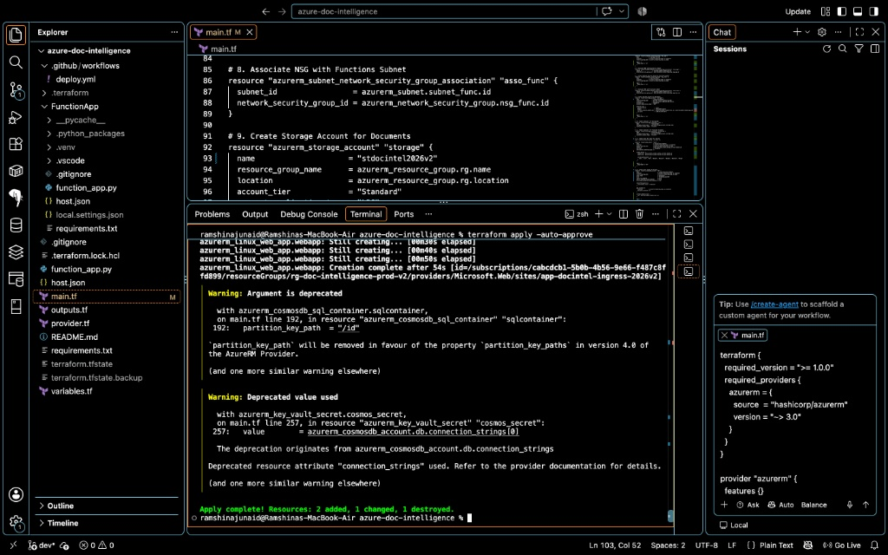
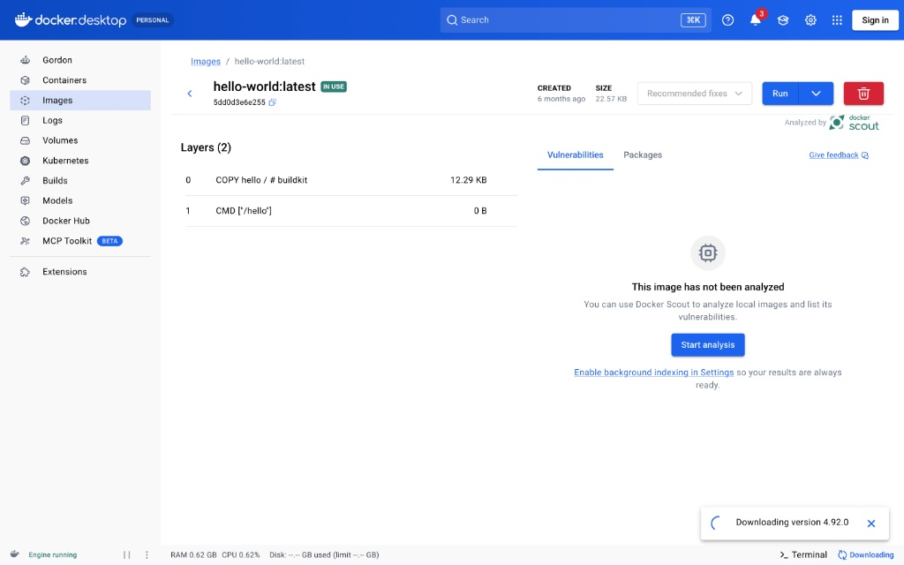
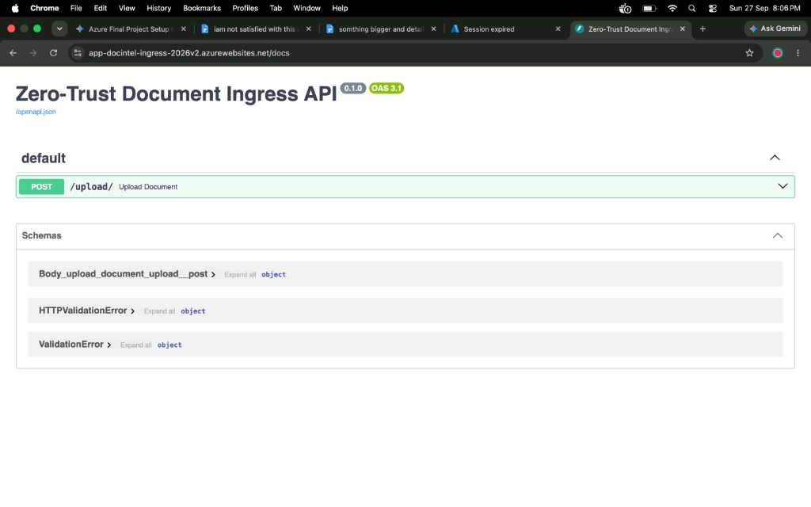
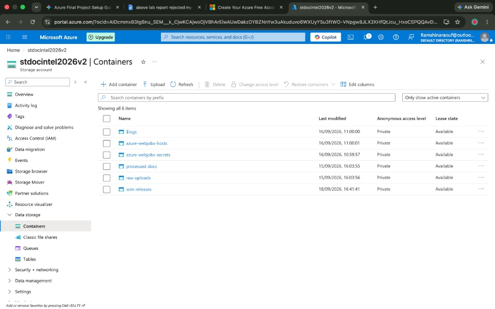
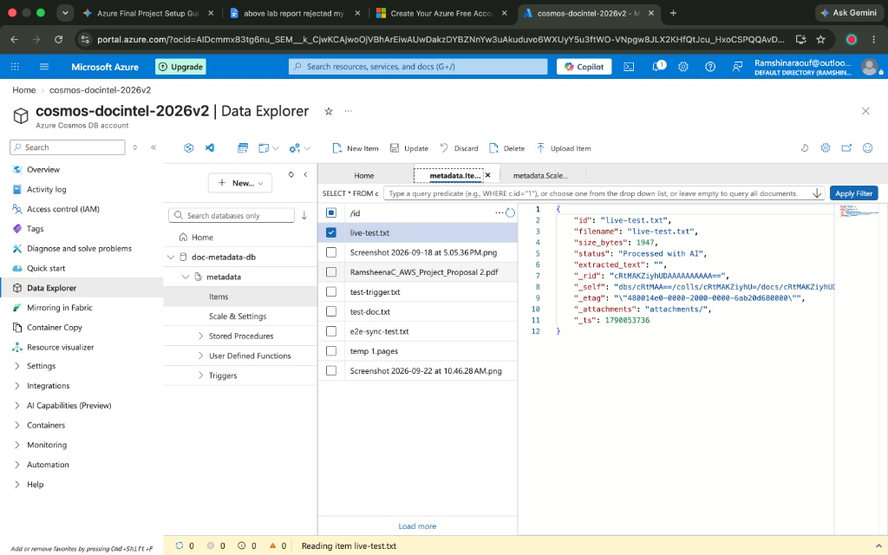
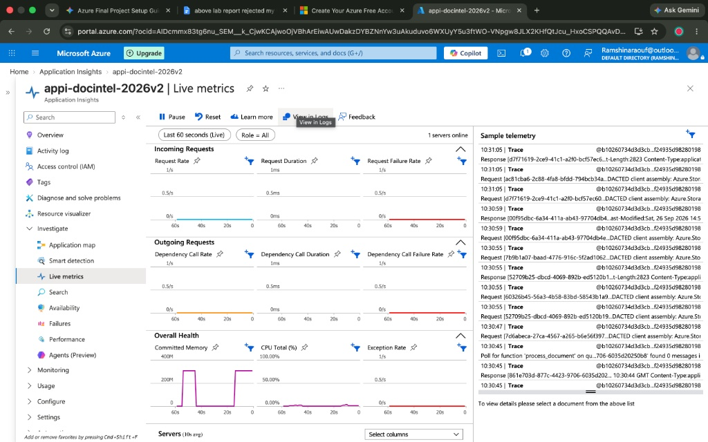

# Project Submission Report

**Project Title:** Event-Driven Serverless Document Intelligence Pipeline

**Submitted By:** Ramsheena C

**Course / Role:** Cloud Computing Trainee

**Institution:** TechnoDot Academy Of R&D&I / Febno Technologies

**Date of Submission:** September 29, 2026

**Primary Cloud Platform:** Microsoft Azure
**Core Technologies Used:** Terraform, Docker, Python (FastAPI), Azure Functions, Cosmos DB, Azure Event Grid, Azure AI Document Intelligence

---

## 1. Executive Summary
This report details the design, deployment, and automation of a cloud-native, serverless document processing architecture on Microsoft Azure. The objective of this project is to create an enterprise-grade pipeline that automatically ingests unstructured documents, extracts metadata using Artificial Intelligence, indexes the output into a NoSQL database, and ensures perfect data synchronization through event-driven automated deletion. By leveraging a microservices approach, the system eliminates idle compute costs and scales dynamically based on workload demands.

## 2. Architectural Workflow (Step-by-Step Data Flow)

```mermaid
graph TD
    classDef client fill:#f9f9f9,stroke:#333,stroke-width:2px;
    classDef compute fill:#0078D4,stroke:#fff,stroke-width:2px,color:#fff;
    classDef storage fill:#008AD7,stroke:#fff,stroke-width:2px,color:#fff;
    classDef ai fill:#00A4EF,stroke:#fff,stroke-width:2px,color:#fff;
    classDef db fill:#5C2D91,stroke:#fff,stroke-width:2px,color:#fff;
    classDef event fill:#FFB900,stroke:#fff,stroke-width:2px,color:#333;

    User([User / Client]):::client
    API[FastAPI Ingress<br/>Azure App Service]:::compute
    RawBlob[(raw-uploads<br/>Azure Blob)]:::storage
    FuncProcess{Azure Function<br/>process_document}:::compute
    AI[Azure AI Document<br/>Intelligence]:::ai
    DB[(Cosmos DB<br/>Metadata & Hash)]:::db
    ProcBlob[(processed-docs<br/>Azure Blob)]:::storage
    EventGrid((Azure Event Grid)):::event
    FuncDelete{Azure Function<br/>delete_metadata}:::compute

    User -- 1. POST Document --> API
    API -- 2. Saves payload --> RawBlob
    API -- 3. Immediate 200 OK --> User
    RawBlob -- 4. BlobTrigger --> FuncProcess
    FuncProcess -- 5. Sends document --> AI
    AI -- 6. Returns structured text --> FuncProcess
    FuncProcess -- 7. Computes SHA-256 & Indexes --> DB
    FuncProcess -- 8. Moves file --> ProcBlob
    FuncProcess -- 9. Purges original --> RawBlob

    ProcBlob -. 10. BlobDeleted Event .-> EventGrid
    EventGrid -. 11. Routes Event .-> FuncDelete
    FuncDelete -. 12. Purges orphaned record .-> DB
```

The pipeline operates on a completely decoupled, event-driven model:
1. **Asynchronous Ingestion:** A user uploads a document via the FastAPI ingress endpoint. The API immediately deposits the file into the `raw-uploads` blob container.
2. **Event Trigger:** The file upload triggers an Azure Function (`process_document`), waking up the compute layer only when needed.
3. **AI Extraction & Integrity:** The function transmits the file to Azure AI to extract structured text and generates a SHA-256 cryptographic hash.
4. **Data Persistence:** Extracted metadata, timestamp, and hash are committed to Cosmos DB. The file moves to `processed-docs`, and the original is deleted.
5. **Synchronized Cleanup (Event Grid):** If a file is manually removed from `processed-docs`, Azure Event Grid instantly detects the deletion and triggers a second function to purge the database record.

## 3. Core Component Breakdown & Implementation

### Infrastructure as Code (Terraform)
The entire cloud environment was provisioned programmatically using Terraform, ensuring an idempotent and reproducible deployment.


### Containerization (Docker)
The FastAPI ingress logic was containerized locally to eliminate environmental discrepancies before being pushed to Azure.


### API Ingress (Azure App Service & FastAPI)
Acts as the high-speed receiver for file payloads, decoupling the upload process from heavy AI operations.


### Storage Layer (Azure Blob Storage)
Provides cost-effective unstructured data storage utilizing `raw-uploads` and `processed-docs` containers.


### Database (Azure Cosmos DB)
A highly available NoSQL database used to store the dynamic JSON metadata payloads generated by the AI extraction.


### Observability (Azure Application Insights)
Centralized telemetry captures execution traces, verifying the serverless functions trigger successfully upon file uploads.


## 4. Phase 2: Enterprise Security & Zero-Trust Roadmap
While Phase 1 successfully proves the core MVP data flows, Phase 2 focuses on enterprise-grade security hardening.

| Feature Category | Phase 1: MVP (Current State) | Phase 2: Production (Future State) |
| :--- | :--- | :--- |
| **Authentication** | Connection Strings & Env Variables | Azure Key Vault & Managed Identities |
| **Network Security** | Public Endpoints | VNet Isolation & Private Endpoints |
| **Secure Access** | Public Internet via Azure Portal | Azure Point-to-Site (P2S) VPN |
| **Deployment** | Manual CLI via Terraform | Automated GitHub Actions CI/CD (OIDC) |

## 5. Conclusion
This pipeline successfully demonstrates a highly modern, cloud-native architecture. By decoupling ingestion, processing, and database operations using storage triggers and Event Grid messaging, the system achieves maximum fault tolerance and scalability.